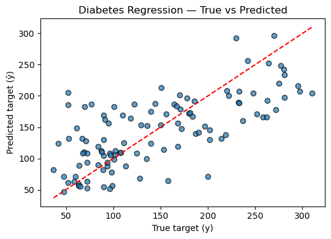
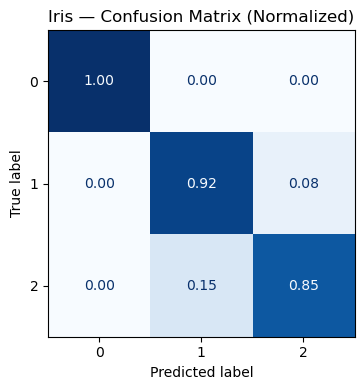
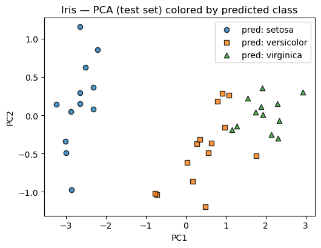
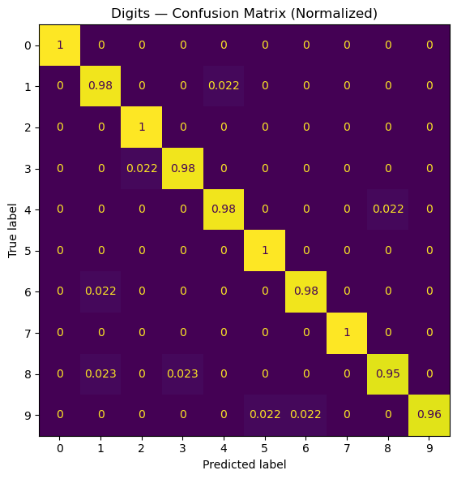

# scikit-learn Basics
*A practical tour of classical ML with scikit-learn — datasets, preprocessing, models, metrics, and pipelines.*

**What you'll learn**
- The **scikit-learn API**: `fit`, `predict`, `score`
- Loading & splitting datasets, **preprocessing** (scaling, one-hot), **pipelines**
- Core models: **LinearRegression**, **LogisticRegression**, **SVC**, **RandomForest**
- **Model selection** via cross-validation & grid search
- Clear plots for diagnostics and evaluation

> Before deep RL, we need strong ML hygiene — splitting data, avoiding leakage, and using robust metrics. These practices transfer directly to training value functions and reward models.


```python
# Imports
import numpy as np
import matplotlib.pyplot as plt

from sklearn import datasets
from sklearn.model_selection import train_test_split, GridSearchCV, cross_val_score, StratifiedKFold
from sklearn.preprocessing import StandardScaler, OneHotEncoder
from sklearn.compose import ColumnTransformer
from sklearn.pipeline import Pipeline
from sklearn.metrics import (
    mean_squared_error, r2_score, accuracy_score, confusion_matrix, ConfusionMatrixDisplay, classification_report
)

from sklearn.linear_model import LinearRegression, LogisticRegression
from sklearn.svm import SVC
from sklearn.ensemble import RandomForestClassifier, RandomForestRegressor
from sklearn.decomposition import PCA

np.random.seed(0)
```

## 1. Quick API Primer

The **scikit-learn API** is designed with a consistent and minimal interface that makes experimenting with models simple and reproducible.  
Almost every algorithm in scikit-learn follows this pattern:

1. `est = Model(**hyperparams)` → **Initialize** the estimator with parameters.  
2. `est.fit(X_train, y_train)` → **Train** (learn parameters from data).  
3. `pred = est.predict(X_test)` → **Infer** on unseen data.  
4. `score = est.score(X_test, y_test)` → **Evaluate** using an appropriate metric.


### Theoretical Insight

In supervised learning, we model the mapping  

$$
\hat{y} = f_\theta(x)
$$

where $ f_\theta $ is parameterized by $\theta$ (weights, coefficients, etc.).  
Training minimizes an empirical risk:

$$
\min_\theta \; \mathcal{L}(\theta) = \frac{1}{N} \sum_{i=1}^{N} \ell(f_\theta(x_i), y_i)
$$

Here, $\ell$ is a **loss function**, e.g. mean squared error or cross-entropy.  
Different estimators implement this optimization internally — linear models solve it analytically, while trees or ensembles do it iteratively.

The design philosophy of scikit-learn enforces:
- **Consistency**: same API for classification, regression, clustering, etc.
- **Composability**: estimators, transformers, and pipelines can be chained.
- **Statelessness**: fit-transform steps are explicit, avoiding hidden state.


### RL Connection

In **Reinforcement Learning**, we often optimize models that map states to actions or predict values/rewards.  
Just like `fit` learns patterns from labeled data, an RL agent **fits** policy parameters to maximize expected return:

$$
J(\theta) = \mathbb{E}_{\pi_\theta} \big[ \sum_t \gamma^t r_t \big]
$$

Conceptually:
- The policy $ \pi_\theta(a\|s) $ plays the role of $ f_\theta(x) $.
- Gradient-based updates in RL (e.g., Policy Gradient, Q-learning) are analogous to scikit-learn’s internal optimization loops.
- Building pipelines and evaluating models (like in scikit-learn) mirrors how we test and tune agents across environments.

> Understanding the fit–predict–evaluate loop prepares you for the **optimize–interact–evaluate** loop in RL.

## 2. Regression — Linear Regression on Diabetes

Regression is a fundamental supervised learning task where the goal is to predict a **continuous target variable** $ y $ from input features $ x $. The simplest and most interpretable model is **Linear Regression**, which assumes a linear relationship:

$$
\hat{y} = w^\top x + b
$$

Here:
- $ w $ are the **weights** (slope coefficients),
- $ b $ is the **bias** (intercept),
- $ \hat{y} $ is the model’s prediction for input $ x $.


### Mathematical Formulation

Given data $ (x_i, y_i)_{i=1}^N $, we minimize the **Mean Squared Error (MSE)**:

$$
\mathcal{L}(w, b) = \frac{1}{N} \sum_{i=1}^{N} (y_i - (w^\top x_i + b))^2
$$

This has a **closed-form solution** (Normal Equation):

$$
\hat{w} = (X^\top X)^{-1} X^\top y
$$

Linear regression thus finds the best-fitting line (or hyperplane) that minimizes the squared residuals between predictions and true values.


### Interpretation & Visualization

When applied to the **Diabetes dataset**, we model how medical metrics (e.g., BMI, glucose level) affect disease progression scores.  
By plotting predicted vs. actual values, we can visually assess:
- **Fit quality:** how close predictions align with targets.
- **Bias/variance:** systematic errors or noise sensitivity.


### RL Connection

Linear regression directly relates to **value function approximation** in Reinforcement Learning.  
For instance, in **Least Squares Temporal Difference (LSTD)** methods, the value function is approximated as:

$$
V^\pi(s) \approx \phi(s)^\top w
$$

where $ \phi(s) $ are **state features** and $ w $ is found by minimizing the temporal difference error — analogous to minimizing MSE in regression.

Thus, understanding linear regression lays the groundwork for:
- **Linear value approximation** (in TD or LSTD),
- **Policy evaluation** under fixed policies,
- **Function approximation stability** and convergence properties.


```python
# Load dataset
X, y = datasets.load_diabetes(return_X_y=True)
X_train, X_test, y_train, y_test = train_test_split(
    X, y, test_size=0.25, random_state=42
)

# Build pipeline: scaling + linear regression
pipe = Pipeline([
    ("scaler", StandardScaler()),
    ("reg", LinearRegression())
])

# Fit model
pipe.fit(X_train, y_train)

# Predict and evaluate
y_pred = pipe.predict(X_test)
mse = mean_squared_error(y_test, y_pred)
r2 = r2_score(y_test, y_pred)

print(f"Mean Squared Error (MSE): {mse:.3f}")
print(f"R² Score: {r2:.3f}")

# True vs. Predicted (Parity Plot)
plt.figure(figsize=(5.5, 4))
plt.scatter(y_test, y_pred, alpha=0.7, edgecolor="k")
plt.plot([y_test.min(), y_test.max()], [y_test.min(), y_test.max()], 'r--')
plt.title("Diabetes Regression — True vs Predicted")
plt.xlabel("True target (y)")
plt.ylabel("Predicted target (ŷ)")
plt.tight_layout()
plt.show()
```

Output:
```
Mean Squared Error (MSE): 2848.311
R² Score: 0.485
```


    

    


## 3. Classification — Logistic Regression on Iris

Classification is a **supervised learning** task where the goal is to assign an input $ x $ to one of several **discrete categories**. Unlike regression (which predicts continuous values), classification outputs probabilities over classes.


### Intuition

Despite its name, **Logistic Regression** is a **linear classifier**, not a regression model. It models the **log-odds** of a class being true as a linear function of inputs:

$$
\log \frac{P(y=1|x)}{1 - P(y=1|x)} = w^\top x + b
$$

Solving for probability gives the **sigmoid form**:

$$
P(y=1|x) = \sigma(w^\top x + b) = \frac{1}{1 + e^{-(w^\top x + b)}}
$$

For multi-class problems (like the **Iris dataset**), logistic regression generalizes via the **softmax function**:

$$
P(y=k|x) = \frac{e^{w_k^\top x}}{\sum_{j} e^{w_j^\top x}}
$$

The model is trained by minimizing the **cross-entropy loss**:

$$
\mathcal{L}(w) = -\frac{1}{N} \sum_{i=1}^N \sum_{k} y_{ik} \log P(y_i=k|x_i)
$$


### Evaluation

We typically assess classification performance via:
- **Accuracy:** fraction of correctly predicted labels.
- **Confusion matrix:** summarizes how often each class was predicted vs. true.
- **Precision/Recall/F1:** more nuanced metrics for imbalanced data.

For the **Iris dataset**, logistic regression learns a linear boundary in feature space separating species (e.g., *setosa*, *versicolor*, *virginica*).


### RL Connection

In **Reinforcement Learning**, many problems involve **classification-like decision boundaries**:
- **Discrete action policies:** modeled using softmax over action preferences 
   
  $$
  \pi(a|s) = \frac{e^{\theta_a^\top \phi(s)}}{\sum_b e^{\theta_b^\top \phi(s)}}
  $$
  
  — identical to multiclass logistic regression.
- **Policy gradient** algorithms update parameters based on log-probability gradients, just like logistic regression’s log-likelihood derivatives.
- **Exploration vs. exploitation** emerges naturally via probabilistic action sampling from these softmax outputs.

Thus, logistic regression forms the **conceptual bridge** between supervised learning and **stochastic policy optimization** in RL.


```python
# Load & split (stratify preserves class balance in the split)
X, y = datasets.load_iris(return_X_y=True)
X_tr, X_te, y_tr, y_te = train_test_split(
    X, y, test_size=0.25, stratify=y, random_state=42
)

# Pipeline: standardize → logistic regression (multinomial by default in sklearn >= 1.2)
clf = Pipeline([
    ("scaler", StandardScaler()),
    ("logreg", LogisticRegression(max_iter=500, multi_class="auto"))
])

# Train
clf.fit(X_tr, y_tr)

# Predict
y_hat = clf.predict(X_te)
y_proba = clf.predict_proba(X_te)

# Metrics
acc = accuracy_score(y_te, y_hat)
print(f"Accuracy: {acc:.4f}")
print("\nClassification report:")
print(classification_report(y_te, y_hat, digits=4))

# Confusion matrix (normalized)
cm = confusion_matrix(y_te, y_hat, labels=clf.classes_, normalize="true")
disp = ConfusionMatrixDisplay(confusion_matrix=cm, display_labels=clf.classes_)
fig, ax = plt.subplots(figsize=(4.8, 4.0))
disp.plot(ax=ax, colorbar=False, cmap="Blues", values_format=".2f")
ax.set_title("Iris — Confusion Matrix (Normalized)")
plt.tight_layout()
plt.show()

# 2D view: PCA projection with predicted labels
# This gives intuition, though the original data are 4D.
pca = PCA(n_components=2).fit(X_tr) # fit PCA on training only
X_te_2d = pca.transform(X_te)

plt.figure(figsize=(5.4, 4.2))
for k, name, marker in zip([0,1,2], ["setosa", "versicolor", "virginica"], ["o","s","^"]):
    idx = (y_hat == k)
    plt.scatter(X_te_2d[idx, 0], X_te_2d[idx, 1], alpha=0.8, label=f"pred: {name}", marker=marker, edgecolor="k")

plt.title("Iris — PCA (test set) colored by predicted class")
plt.xlabel("PC1"); plt.ylabel("PC2"); plt.legend(frameon=True)
plt.tight_layout()
plt.show()
```

Output:
```
Accuracy: 0.9211
    
Classification report:
              precision    recall  f1-score   support
    
           0     1.0000    1.0000    1.0000        12
           1     0.8571    0.9231    0.8889        13
           2     0.9167    0.8462    0.8800        13
    
    accuracy                         0.9211        38
   macro avg     0.9246    0.9231    0.9230        38
weighted avg     0.9226    0.9211    0.9209        38
```


    

    


    

    


## 4. Model Selection — SVC with GridSearchCV

In machine learning, **model selection** ensures we choose the best hyperparameters for generalization rather than just fitting the training data.

A **Support Vector Classifier (SVC)** finds a separating hyperplane that maximizes the **margin** between classes:

$$
\min_{w,b} \frac{1}{2}\|w\|^2 \quad \text{s.t.} \quad y_i(w^\top x_i + b) \ge 1
$$

The optimization is controlled by two key hyperparameters:
- $ C $: regularization strength — smaller $C$ allows more margin violations (simpler model).  
- $ \gamma $: kernel coefficient in the RBF kernel $ K(x_i, x_j) = \exp(-\gamma \|x_i - x_j\|^2) $, controlling smoothness.


### Grid Search & Cross-Validation

`GridSearchCV` systematically explores hyperparameter combinations, training and validating each one via **cross-validation (CV)**.

For example:
- Split data into *k* folds.  
- Train on *k−1* folds, validate on the remaining fold.  
- Repeat *k* times and average the scores.

The model achieving the best mean CV score becomes the final estimator.

Mathematically, we select:

$$
\theta^* = \arg\max_\theta \frac{1}{K}\sum_{k=1}^K \text{Acc}_k(\theta)
$$


### In Practice

In scikit-learn, this looks like:

```python
GridSearchCV(estimator=SVC(), param_grid={"C":[0.1,1,10], "gamma":[0.01,0.1,1]}, cv=5)
```

The result object stores:
- `best_params_`: best hyperparameter combination
- `best_estimator_`: refitted final model
- `cv_results_`: detailed validation scores


### RL Connection

In Reinforcement Learning, hyperparameter tuning plays a similarly crucial role:

- Learning rates ($\eta$), discount factors ($\gamma$), and entropy coefficients affect stability.
- Methods like **policy search** or **meta-learning** can be seen as continuous analogues of grid search.
- In deep RL, adaptive search (like **Population-Based Training**) acts as a scalable form of hyperparameter optimization.


```python
# 1) Data split (stratified)
X, y = datasets.load_digits(return_X_y=True)
X_tr, X_te, y_tr, y_te = train_test_split(
    X, y, test_size=0.25, stratify=y, random_state=0
)

# 2) Pipeline: scale -> SVC
pipe = Pipeline([
    ("scaler", StandardScaler()),
    ("svc", SVC())
])

# 3) Hyperparameter grid (wider, log-spaced C; include 'scale' and numeric gammas)
param_grid = {
    "svc__kernel": ["rbf"],
    "svc__C": [0.1, 1, 3, 10],
    "svc__gamma": ["scale", 0.01, 0.003, 0.001],
}

# 4) Cross-validation (stratified, shuffled for stability)
cv = StratifiedKFold(n_splits=5, shuffle=True, random_state=0)

search = GridSearchCV(
    estimator=pipe,
    param_grid=param_grid,
    cv=cv,
    n_jobs=-1,
    refit=True,
    return_train_score=False,
)

# 5) Fit grid search
search.fit(X_tr, y_tr)

print("Best params:", search.best_params_)
print("Best CV score:", round(search.best_score_, 4))

# 6) Evaluate on held-out test set
test_acc = search.score(X_te, y_te)
print("Test accuracy:", round(test_acc, 4))

# Detailed report
y_pred = search.predict(X_te)
print("\nClassification Report (test):\n", classification_report(y_te, y_pred, digits=4))

# 7) Normalized confusion matrix for interpretability
cm = confusion_matrix(y_te, y_pred, labels=np.unique(y_te), normalize="true")
disp = ConfusionMatrixDisplay(confusion_matrix=cm, display_labels=np.unique(y_te))
fig, ax = plt.subplots(figsize=(6, 6))
disp.plot(ax=ax, colorbar=False)
ax.set_title("Digits — Confusion Matrix (Normalized)")
plt.tight_layout()
plt.show()

# Quick glance at top CV configs
def top_k_cv_results(search, k=5):
    # sort by mean test score (descending)
    order = np.argsort(-search.cv_results_["mean_test_score"])
    print(f"\nTop {k} CV configs:")
    for i in order[:k]:
        params = search.cv_results_["params"][i]
        mean = search.cv_results_["mean_test_score"][i]
        std = search.cv_results_["std_test_score"][i]
        print(f"  mean={mean:.4f}±{std:.4f}  |  {params}")

top_k_cv_results(search, k=5)
```

Output:
```
Best params: {'svc__C': 10, 'svc__gamma': 0.003, 'svc__kernel': 'rbf'}
Best CV score: 0.9852
Test accuracy: 0.9822
    
Classification Report (test):
               precision    recall  f1-score   support

           0     1.0000    1.0000    1.0000        45
           1     0.9574    0.9783    0.9677        46
           2     0.9778    1.0000    0.9888        44
           3     0.9783    0.9783    0.9783        46
           4     0.9778    0.9778    0.9778        45
           5     0.9787    1.0000    0.9892        46
           6     0.9778    0.9778    0.9778        45
           7     1.0000    1.0000    1.0000        45
           8     0.9762    0.9535    0.9647        43
           9     1.0000    0.9556    0.9773        45

    accuracy                         0.9822       450
   macro avg     0.9824    0.9821    0.9822       450
weighted avg     0.9824    0.9822    0.9822       450
```


    

    


    Top 5 CV configs:
      mean=0.9852±0.0066  |  {'svc__C': 10, 'svc__gamma': 0.003, 'svc__kernel': 'rbf'}
      mean=0.9829±0.0038  |  {'svc__C': 3, 'svc__gamma': 0.01, 'svc__kernel': 'rbf'}
      mean=0.9822±0.0044  |  {'svc__C': 10, 'svc__gamma': 0.01, 'svc__kernel': 'rbf'}
      mean=0.9814±0.0041  |  {'svc__C': 1, 'svc__gamma': 0.01, 'svc__kernel': 'rbf'}
      mean=0.9800±0.0030  |  {'svc__C': 3, 'svc__gamma': 0.003, 'svc__kernel': 'rbf'}


## 5. Pipelines & ColumnTransformer (Mixed Data)

Real-world datasets often mix **numerical**, **categorical**, and sometimes **textual** features. Good ML hygiene means **processing each feature type appropriately** before fitting a model.


### ColumnTransformer
`ColumnTransformer` allows you to specify **different preprocessing pipelines** for subsets of columns:

$$
\text{preprocess}(X) = [\text{scale}(X_{\text{num}}), \ \text{onehot}(X_{\text{cat}})]
$$

Example:
- Numerical columns → `StandardScaler`  
- Categorical columns → `OneHotEncoder`

In scikit-learn:

```python
ColumnTransformer([
    ("num", StandardScaler(), num_cols),
    ("cat", OneHotEncoder(), cat_cols)
])
```

This is then chained with a model inside a single `Pipeline`, ensuring all transformations happen automatically during training and inference.


### Why Pipelines Matter
- Avoid **data leakage** (preprocessing fitted on train only).
- Ensure **reproducibility** — consistent transformations in training and testing.
- Simplify cross-validation: preprocessing is applied in each fold automatically.
- Integrate seamlessly with `GridSearchCV`.


### RL Connection

In Reinforcement Learning:

- Pipelines parallel the **data flow** from raw state → features → policy/value function input.
- Different state variables (numerical sensors, categorical events, discrete flags) often require heterogeneous preprocessing.
- Consistent transformations across experience replay buffers or rollouts are crucial for **stable learning**.

Formally, this mirrors the function composition:

$$
\pi(a|s) = f_\theta(\text{encode}(s)) = f_\theta([\text{scale}(s_{\text{num}}), \text{embed}(s_{\text{cat}})])
$$

where preprocessing ensures features align correctly for policy or critic networks.


```python
# Synthetic mixed features: numeric + categorical
n = 400
num1 = np.random.randn(n)
num2 = 2*np.random.randn(n) + 1.0
cat = np.random.choice(["A","B","C"], size=n)
y = (num1 + 0.5*num2 + (cat=="B").astype(float) + 0.1*np.random.randn(n) > 0.8).astype(int)

# Build feature matrix
X = np.column_stack([num1, num2, cat])

# Preprocess: scale numeric, one-hot categorical
ct = ColumnTransformer([
    ("num", StandardScaler(), [0,1]),
    ("cat", OneHotEncoder(handle_unknown="ignore"), [2])
])

model = Pipeline([
    ("pre", ct),
    ("clf", RandomForestClassifier(n_estimators=200, random_state=0))
])

X_tr, X_te, y_tr, y_te = train_test_split(X, y, test_size=0.25, stratify=y, random_state=0)
model.fit(X_tr, y_tr)
print("Accuracy (mixed features):", round(model.score(X_te, y_te), 4))
```

Output:
```
Accuracy (mixed features): 0.94
```

## Key Takeaways

- **Unified API** — scikit-learn provides a clean, modular workflow (`fit → predict → evaluate`) for all model types.  
- **Regression & Classification** — Linear and Logistic Regression illustrate core supervised learning concepts foundational to RL critics and policies.  
- **Model Selection** — `GridSearchCV` and cross-validation ensure generalizable models, analogous to tuning hyperparameters in RL (learning rate, γ, entropy coeff).  
- **Pipelines & ColumnTransformer** — enforce preprocessing discipline, prevent data leakage, and mirror structured state preprocessing in RL environments.  
- These practices translate directly to RL when optimizing value functions, fitting dynamics models, or training policy networks.

**Next:** `04_pytorch_basics.ipynb` → deep learning fundamentals and gradient-based optimization in PyTorch.
