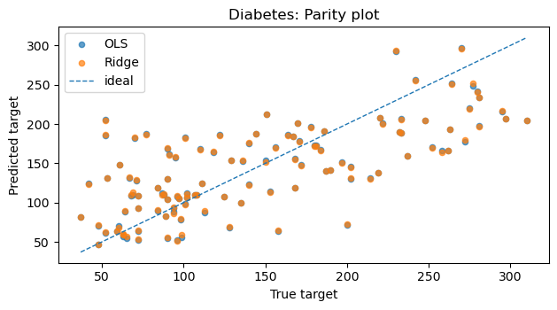
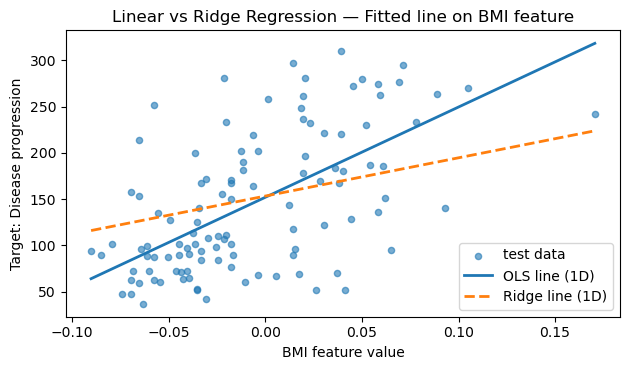
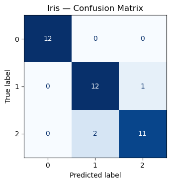
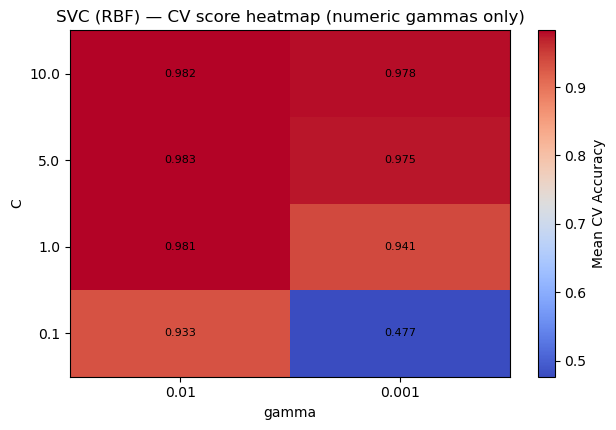
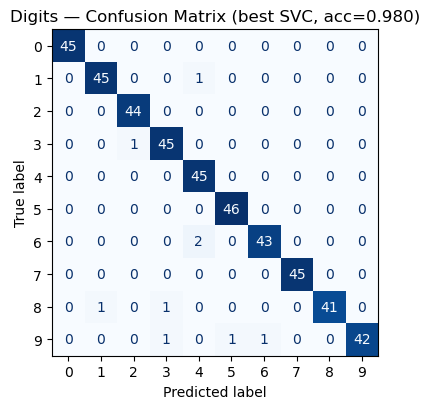

# Basic Machine Learning

*Clean, principled ML workflows that we’ll reuse for RL critics, reward models, and diagnostics.*

**What you'll learn**
- Regression: linear models, train/test split, and error metrics ($MSE$, $MAE$, and $ R^2 $).
- Classification: logistic regression / SVC, accuracy vs. precision/recall/F1, ROC–AUC.
- Model validation: cross-validation, bias–variance intuition, and over/underfitting.
- Good hygiene: feature scaling, pipelines, and reproducible experiments.

> Critics are regressors; policies are classifiers over discrete actions (softmax). Getting ML right makes RL training far easier to debug.

## 0. Introduction to Machine Learning

**Machine Learning (ML)** is the study of algorithms that learn patterns from data and make predictions or decisions without being explicitly programmed. At its core, ML is about **mapping inputs to outputs** using data-driven optimization.

Formally, given data samples  

$$
\mathcal{D} = \{(x_i, y_i)\}_{i=1}^N,
$$  

ML finds parameters $ \theta $ of a function $ f_\theta(x) $ that minimize a **loss** measuring the discrepancy between predictions and ground truth:  

$$
\min_\theta \; \frac{1}{N} \sum_{i=1}^N \mathcal{L}(f_\theta(x_i), y_i).
$$

Depending on the type of target $y_i$:  
- **Regression:** $y_i \in \mathbb{R}$ → predict continuous values.  
- **Classification:** $y_i \in \{1, \ldots, K\}$ → predict class probabilities.  
- **Clustering / Unsupervised:** no $y_i$, learn latent structure.  

**RL Connection:**  
In Reinforcement Learning, these same principles reappear —  
- *Value functions* are **regressors** (predicting expected returns).  
- *Policies* are **classifiers** (predicting action probabilities).  
- *Reward models* and *critics* use standard ML losses (MSE, cross-entropy) to learn from interaction data.


```python
import numpy as np
import matplotlib.pyplot as plt
from sklearn import datasets
from sklearn.model_selection import train_test_split, GridSearchCV, StratifiedKFold
from sklearn.preprocessing import StandardScaler, label_binarize
from sklearn.pipeline import Pipeline
from sklearn.linear_model import LinearRegression, Ridge, LogisticRegression
from sklearn.svm import SVC
from sklearn.metrics import (
    accuracy_score, precision_recall_fscore_support,
    confusion_matrix, ConfusionMatrixDisplay, roc_auc_score, roc_curve
)
```

## 1. Regression — Theory

Given input–target pairs $$ \{(x_i, y_i)\}_{i=1}^N $$ with $y_i \in \mathbb{R}$, a regressor $f_\theta(x)$ is trained by minimizing an error objective, commonly **Mean Squared Error (MSE)**:

$$
\mathcal{L}(\theta) = \frac{1}{N} \sum_{i=1}^N \big(f_\theta(x_i) - y_i\big)^2.
$$

Other useful metrics include:
- **MAE:** $$ \frac{1}{N}\sum_i \\|f_\theta(x_i)-y_i\| $$ (robust to outliers)  
- **$R^2$:** $$ 1 - \frac{\sum_i (y_i-\hat y_i)^2}{\sum_i (y_i-\bar y)^2} $$ (explained variance)

**Scaling matters:** Feature normalization often improves gradient convergence and model stability.

**RL Connection:**  
Regression is fundamental in RL — critics and Q-functions predict expected returns $ \hat{V}(s) \approx \mathbb{E}[G_t | S_t=s] $, optimizing the same MSE loss as standard regression models.


```python
# LinearRegression vs Ridge on Diabetes dataset

# Reproducibility
np.random.seed(0)

# Data
X, y = datasets.load_diabetes(return_X_y=True)
X_tr, X_te, y_tr, y_te = train_test_split(X, y, test_size=0.25, random_state=42)

# Pipelines
pipe_ols = Pipeline([
    ("scaler", StandardScaler()),
    ("reg", LinearRegression())
])
pipe_ridge = Pipeline([
    ("scaler", StandardScaler()),
    ("reg", Ridge(alpha=1.0, random_state=42))
])

# Fit
pipe_ols.fit(X_tr, y_tr)
pipe_ridge.fit(X_tr, y_tr)

# Predict
y_pred_ols = pipe_ols.predict(X_te)
y_pred_rdg = pipe_ridge.predict(X_te)

# Metrics helper
def report(y_true, y_pred):
    return {
        "MSE": round(mean_squared_error(y_true, y_pred), 3),
        "MAE": round(mean_absolute_error(y_true, y_pred), 3),
        "R2":  round(r2_score(y_true, y_pred), 3),
    }

print("LinearRegression:", report(y_te, y_pred_ols))
print("Ridge(alpha=1.0):", report(y_te, y_pred_rdg))

# Parity (y_true vs y_pred)
plt.figure(figsize=(6.4, 3.6))
plt.scatter(y_te, y_pred_ols, s=20, alpha=0.7, label="OLS")
plt.scatter(y_te, y_pred_rdg, s=20, alpha=0.7, label="Ridge")
lims = [min(y_te.min(), y_pred_ols.min(), y_pred_rdg.min()),
        max(y_te.max(), y_pred_ols.max(), y_pred_rdg.max())]
plt.plot(lims, lims, linestyle="--", linewidth=1, label="ideal")
plt.title("Diabetes: Parity plot")
plt.xlabel("True target")
plt.ylabel("Predicted target")
plt.legend()
plt.tight_layout()
plt.show()

# Fitted line on a single feature (BMI) for intuition
# Choosing one interpretable feature (BMI is feature index 2 in the diabetes dataset)
feature_idx = 2  # BMI
X_tr_feat = X_tr[:, feature_idx].reshape(-1, 1)
X_te_feat = X_te[:, feature_idx].reshape(-1, 1)

# Fit simple 1D regressors for visualization
lr_1d = LinearRegression().fit(X_tr_feat, y_tr)
ridge_1d = Ridge(alpha=1.0).fit(X_tr_feat, y_tr)

# Build a smooth grid over the test feature range
x_min = X_te_feat.min()
x_max = X_te_feat.max()
X_line = np.linspace(x_min, x_max, 200).reshape(-1, 1)

y_line_lr = lr_1d.predict(X_line)
y_line_ridge = ridge_1d.predict(X_line)

plt.figure(figsize=(6.4, 3.8))
plt.scatter(X_te_feat, y_te, s=20, alpha=0.6, label="test data")
plt.plot(X_line, y_line_lr, label="OLS line (1D)", lw=2)
plt.plot(X_line, y_line_ridge, label="Ridge line (1D)", lw=2, linestyle="--")
plt.title("Linear vs Ridge Regression — Fitted line on BMI feature")
plt.xlabel("BMI feature value")
plt.ylabel("Target: Disease progression")
plt.legend()
plt.tight_layout()
plt.show()
```

Output:
```
LinearRegression: {'MSE': 2848.311, 'MAE': 41.549, 'R2': 0.485}
Ridge(alpha=1.0): {'MSE': 2842.835, 'MAE': 41.507, 'R2': 0.486}
```


    

    


    

    


## 2. Classification — Theory

In **classification**, we predict discrete class labels $ y \in \{1, 2, \dots, K\} $ given input features $ x $. The model outputs **class probabilities** $ p_\theta(y \mid x) $, and training seeks to minimize the **cross-entropy loss**:

$$
\mathcal{L}(\theta)
= -\frac{1}{N} \sum_{i=1}^N \log p_\theta(y_i|x_i)
$$

For binary classification (e.g., logistic regression),  

$$
p_\theta(y=1|x) = \sigma(w^\top x + b),
$$

where $ \sigma(z) = \frac{1}{1 + e^{-z}} $ is the **sigmoid function**.


### Key Evaluation Metrics

| Metric | Formula / Idea | Use |
|---------|----------------|-----|
| **Accuracy** | $ \frac{\text{\# correct}}{\text{\# total}} $ | Quick global metric |
| **Precision / Recall** | Precision = $ \frac{TP}{TP + FP} $; Recall = $ \frac{TP}{TP + FN} $ | Handle class imbalance |
| **ROC–AUC** | Area under ROC curve | Measures threshold-independent ranking ability |


### Practical Tips

- **Feature scaling** is crucial for gradient-based models (e.g., Logistic Regression, SVM).  
- Use **Pipelines** to ensure preprocessing (e.g., `StandardScaler`) occurs inside cross-validation folds → prevents **data leakage**.  
- In multi-class problems, **softmax regression** generalizes logistic regression.


### RL Connection

Classification concepts directly transfer to RL tasks:
- **Policy Learning:** A stochastic policy $ \pi(a\|s) $ predicts *action probabilities* — like a softmax classifier over actions.  
- **Reward Classification:** In inverse RL or preference learning, models classify which actions lead to higher returns.  
- **Exploration:** Action distributions with entropy regularization resemble probabilistic classifiers balancing exploration vs. exploitation.


```python
# Data
X, y = datasets.load_iris(return_X_y=True)
classes = np.unique(y)
X_tr, X_te, y_tr, y_te = train_test_split(
    X, y, test_size=0.25, stratify=y, random_state=42
)

# Model (multinomial softmax)
clf = Pipeline([
    ("scaler", StandardScaler()),
    ("logreg", LogisticRegression(
        solver="lbfgs", multi_class="multinomial",
        max_iter=1000, random_state=42
    ))
])
clf.fit(X_tr, y_tr)

# Predictions + metrics
y_hat = clf.predict(X_te)
proba = clf.predict_proba(X_te)

acc = accuracy_score(y_te, y_hat)
prec, rec, f1, _ = precision_recall_fscore_support(
    y_te, y_hat, average="macro"
)
print({"accuracy": round(acc, 4),
       "precision": round(prec, 4),
       "recall": round(rec, 4),
       "f1": round(f1, 4)})

# ROC–AUC (one-vs-rest): plot per class and macro AUC
y_te_binarized = label_binarize(y_te, classes=classes)  # shape (n_samples, n_classes)

# Macro AUC
macro_auc = roc_auc_score(y_te_binarized, proba, average="macro", multi_class="ovr")
print(f"Macro ROC-AUC (OvR): {macro_auc:.3f}")

# Confusion matrix
cm = confusion_matrix(y_te, y_hat, labels=classes)
disp = ConfusionMatrixDisplay(confusion_matrix=cm, display_labels=classes)
fig, ax = plt.subplots(figsize=(4.8, 3.8))
disp.plot(ax=ax, colorbar=False, cmap="Blues")
plt.title("Iris — Confusion Matrix")
plt.tight_layout()
plt.show()
```
Output:
```
{'accuracy': 0.9211, 'precision': 0.9246, 'recall': 0.9231, 'f1': 0.923}
Macro ROC-AUC (OvR): 0.996
```


    

    


## 3. Model Validation — Cross-Validation & Bias–Variance

In **machine learning**, we aim to estimate how well a model generalizes to unseen data.  
Simple train–test splits can be unreliable for small datasets — **Cross-Validation (CV)** mitigates this by averaging performance across multiple folds.

### Cross-Validation (CV)
Data is divided into $K$ folds:
1. Train on $K-1$ folds.
2. Validate on the remaining fold.
3. Repeat for all folds and average results.

The best hyperparameters are chosen by maximizing average validation score:

$$
\theta^* = \arg\max_\theta \frac{1}{K} \sum_{k=1}^K \text{Score}_k(\theta)
$$

This ensures a more stable estimate of model performance and reduces dependence on any single data split.


### Bias–Variance Trade-off
The **total prediction error** can be decomposed as:

$$
\text{Error} = \text{Bias}^2 + \text{Variance} + \text{Irreducible Noise}.
$$

- **High Bias:** The model is too simple → underfitting.
- **High Variance:** The model is too flexible → overfitting.
- **Regularization (e.g., Ridge’s α):** adds penalty to reduce variance while maintaining fit.

Balancing both is key to strong generalization — tuning hyperparameters via CV directly controls this balance.


### RL Connection
Cross-validation parallels evaluation in Reinforcement Learning:
- RL agents require **policy evaluation** (e.g., Monte Carlo rollouts) to estimate performance.
- Bias–variance trade-offs appear in **value estimation**:  
  - *Monte Carlo* → low bias, high variance.  
  - *Temporal Difference (TD)* → higher bias, lower variance.  
  - *λ-returns* interpolate between the two, analogous to regularization in supervised learning.

Both domains rely on the same principle: balancing **fit vs. stability** for optimal generalization and learning efficiency.


```python
# SVC model selection with GridSearchCV — reports + heatmap + confusion matrix

# Data
X, y = datasets.load_digits(return_X_y=True)
X_tr, X_te, y_tr, y_te = train_test_split(
    X, y, test_size=0.25, stratify=y, random_state=0
)

# Pipeline + Grid
pipe = Pipeline([
    ("scaler", StandardScaler()),
    ("svc", SVC())
])
param_grid = {
    "svc__kernel": ["rbf"],
    "svc__C": [0.1, 1, 5, 10],
    "svc__gamma": ["scale", 0.01, 0.001]
}

cv = StratifiedKFold(n_splits=5, shuffle=True, random_state=0)
search = GridSearchCV(
    estimator=pipe,
    param_grid=param_grid,
    cv=cv,
    n_jobs=-1,
    refit=True,
    return_train_score=False
)

# Fit search
search.fit(X_tr, y_tr)

print("Best params:", search.best_params_)
print("Best CV score:", round(search.best_score_, 4))

# Test-set evaluation
best = search.best_estimator_
y_hat = best.predict(X_te)
test_acc = accuracy_score(y_te, y_hat)
print("Test accuracy:", round(test_acc, 4))

# Top-3 CV configs
order = np.argsort(-search.cv_results_["mean_test_score"])
print("\nTop 3 CV configs:")
for i in order[:3]:
    params = search.cv_results_["params"][i]
    mean = search.cv_results_["mean_test_score"][i]
    std  = search.cv_results_["std_test_score"][i]
    print(f"  mean={mean:.4f} ± {std:.4f} | {params}")

# Heatmap of CV score over (C, gamma) for numeric gammas only
Cs = np.array([0.1, 1, 5, 10], dtype=float)
gammas_num = np.array([0.01, 0.001], dtype=float)

# Build score matrix [len(Cs) x len(gammas_num)]
score_mat = np.full((len(Cs), len(gammas_num)), np.nan, dtype=float)
params_list = search.cv_results_["params"]
means = search.cv_results_["mean_test_score"]

for p, m in zip(params_list, means):
    C = p["svc__C"]
    gamma = p["svc__gamma"]
    if isinstance(gamma, float) or isinstance(gamma, int):
        # locate indices
        i = np.where(Cs == float(C))[0]
        j = np.where(gammas_num == float(gamma))[0]
        if i.size and j.size:
            score_mat[i[0], j[0]] = m

plt.figure(figsize=(6.4, 4.4))
im = plt.imshow(score_mat, origin="lower", aspect="auto", cmap="coolwarm",)
plt.colorbar(im, label="Mean CV Accuracy")
plt.xticks(ticks=np.arange(len(gammas_num)), labels=[str(g) for g in gammas_num])
plt.yticks(ticks=np.arange(len(Cs)), labels=[str(c) for c in Cs])
plt.xlabel("gamma")
plt.ylabel("C")
plt.title("SVC (RBF) — CV score heatmap (numeric gammas only)")
# annotate cells
for i in range(len(Cs)):
    for j in range(len(gammas_num)):
        val = score_mat[i, j]
        if not np.isnan(val):
            plt.text(j, i, f"{val:.3f}", ha="center", va="center", fontsize=8)
plt.tight_layout()
plt.show()


# Confusion matrix on test set
cm = confusion_matrix(y_te, y_hat, labels=np.unique(y))
disp = ConfusionMatrixDisplay(confusion_matrix=cm, display_labels=np.unique(y))
fig, ax = plt.subplots(figsize=(5.2, 4.2))
disp.plot(ax=ax, colorbar=False, cmap="Blues")
plt.title(f"Digits — Confusion Matrix (best SVC, acc={test_acc:.3f})")
plt.tight_layout()
plt.show()
```

Output:
```
Best params: {'svc__C': 5, 'svc__gamma': 0.01, 'svc__kernel': 'rbf'}
Best CV score: 0.9829
Test accuracy: 0.98
    
Top 3 CV configs:
  mean=0.9829 ± 0.0038 | {'svc__C': 5, 'svc__gamma': 0.01, 'svc__kernel': 'rbf'}
  mean=0.9822 ± 0.0044 | {'svc__C': 10, 'svc__gamma': 0.01, 'svc__kernel': 'rbf'}
  mean=0.9814 ± 0.0041 | {'svc__C': 1, 'svc__gamma': 0.01, 'svc__kernel': 'rbf'}
```


    

    


    

    


## 4. RL Tie‑In (Why this matters)

- **Critics as Regressors:** value/Q estimates minimize squared TD errors (an MSE).  
- **Policies as Classifiers:** discrete actions often use a softmax head; evaluation benefits from precision/recall-like diagnostics when actions are imbalanced.  
- **Validation Mindset:** although RL is non‑IID, careful train/validation splits for **offline RL** or synthetic rollouts help compare algorithms fairly.  
- **Pipelines & Scaling:** the same preprocessing discipline reduces instability when training function approximators in RL.

## Key Takeaways

- **Regression:** Evaluate models with $MSE$, $MAE$, and $ R^2 $; use regularization (Ridge/Lasso) to manage bias–variance trade-offs.  
- **Classification:** Go beyond accuracy—analyze confusion matrices, precision/recall/F1, and ROC–AUC for a full performance picture.  
- **Validation:** Apply cross-validation to select hyperparameters robustly and avoid overfitting.  
- **Best Practices:** Pipelines ensure clean preprocessing, prevent data leakage, and keep experiments reproducible across tasks.  

**Next:** `07_basic_deep_learning.ipynb` → Build intuition for neurons, MLPs, and CNNs as foundations for deep RL.
