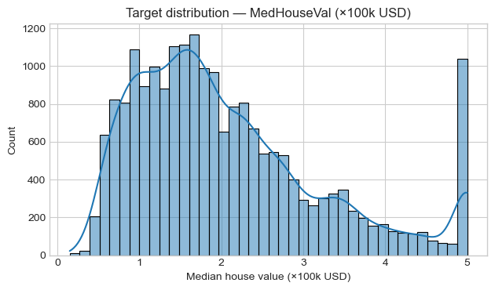
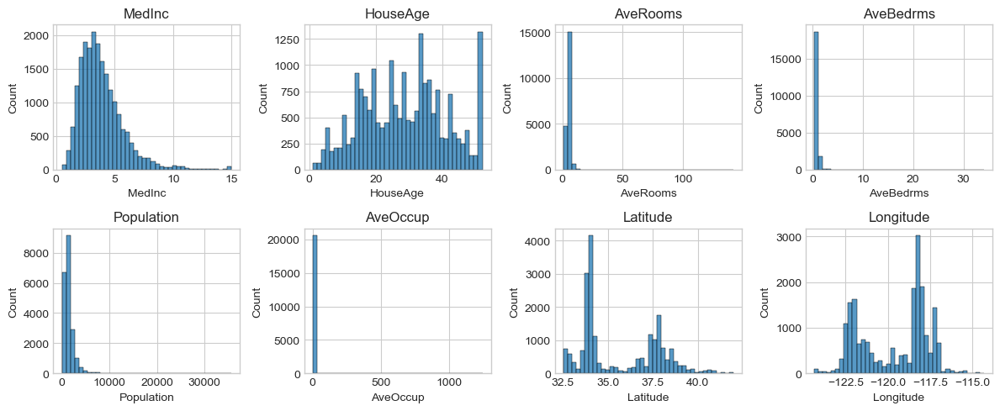
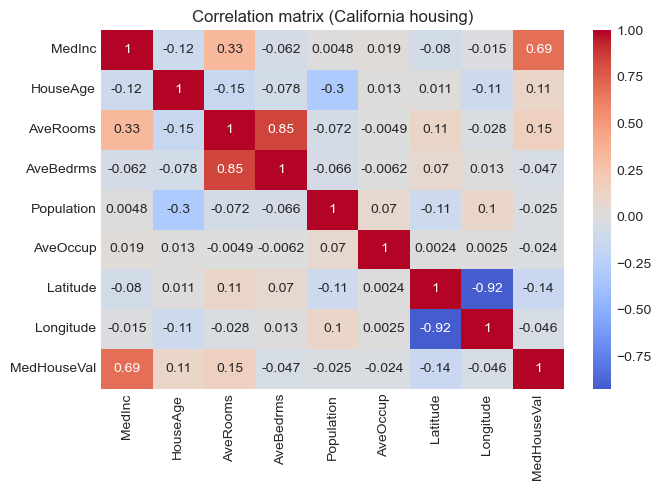
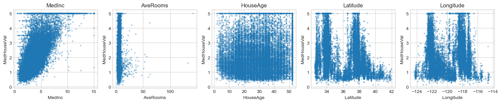
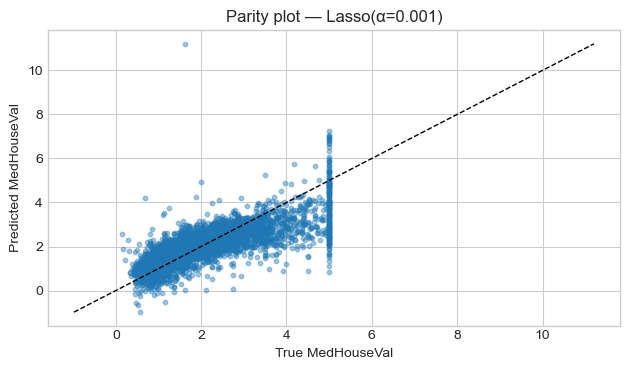
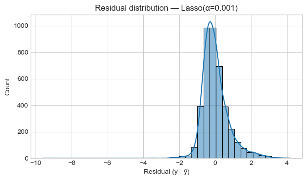
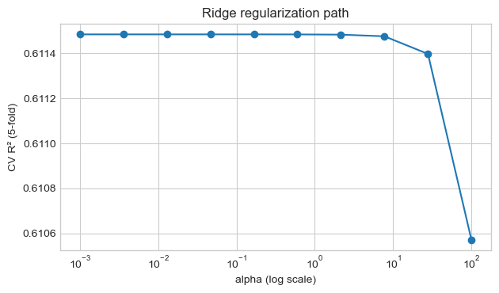

# End-to-End Linear Regression Project  
*California Housing Prices: from raw data → model → mini "deployment".*

**Goal:**  
Build a complete regression pipeline on a real-world dataset:

- Load and inspect a real housing dataset (California census tracts).  
- Perform **EDA**: distributions, correlations, feature–target relationships.  
- Do basic **preprocessing** and train–validation splitting.  
- Train and compare several **linear models** (OLS, Ridge, Lasso).  
- Evaluate with **MSE / MAE / R²**, plus visual diagnostics.  
- Wrap the best model into a tiny **prediction function** as a mini “deployment”.

This project glues together ideas from:

- Probability & statistics (noise, variance, metrics)  
- Linear algebra & gradient-based optimization  
- Basic ML (regression, regularization, model selection)


```python
import numpy as np
import pandas as pd
import matplotlib.pyplot as plt
import seaborn as sns

from sklearn.datasets import fetch_california_housing
from sklearn.model_selection import train_test_split, cross_val_score
from sklearn.preprocessing import StandardScaler, PolynomialFeatures
from sklearn.pipeline import Pipeline
from sklearn.linear_model import LinearRegression, Ridge, Lasso
from sklearn.metrics import mean_squared_error, mean_absolute_error, r2_score

# Reproducibility
RANDOM_STATE = 42
np.random.seed(RANDOM_STATE)

plt.style.use("seaborn-v0_8-whitegrid")
plt.rcParams["figure.figsize"] = (6.4, 3.8)
plt.rcParams["axes.titlesize"] = 12
```

## 1. Dataset & Problem Statement

We’ll use **California housing** data:

- Each row = a **census block group** in California.
- Features (per block): median income, house age, average rooms, population, latitude/longitude, etc.
- Target: `MedHouseVal` — **median house value (in \$100,000s)**.

**Task:**  
Given block-level features, predict the median house value.

This is a **tabular regression** problem, very typical in applied ML.


```python
# Load into DataFrame
cal = fetch_california_housing(as_frame=True)
df = cal.frame.copy()

print("Shape:", df.shape)
df.head()
```

Output:
```
Shape: (20640, 9)
```


<div>
<style scoped>
    .dataframe tbody tr th:only-of-type {
        vertical-align: middle;
    }

    .dataframe tbody tr th {
        vertical-align: top;
    }

    .dataframe thead th {
        text-align: right;
    }
</style>
<table border="1" class="dataframe">
  <thead>
    <tr style="text-align: right;">
      <th></th>
      <th>MedInc</th>
      <th>HouseAge</th>
      <th>AveRooms</th>
      <th>AveBedrms</th>
      <th>Population</th>
      <th>AveOccup</th>
      <th>Latitude</th>
      <th>Longitude</th>
      <th>MedHouseVal</th>
    </tr>
  </thead>
  <tbody>
    <tr>
      <th>0</th>
      <td>8.3252</td>
      <td>41.0</td>
      <td>6.984127</td>
      <td>1.023810</td>
      <td>322.0</td>
      <td>2.555556</td>
      <td>37.88</td>
      <td>-122.23</td>
      <td>4.526</td>
    </tr>
    <tr>
      <th>1</th>
      <td>8.3014</td>
      <td>21.0</td>
      <td>6.238137</td>
      <td>0.971880</td>
      <td>2401.0</td>
      <td>2.109842</td>
      <td>37.86</td>
      <td>-122.22</td>
      <td>3.585</td>
    </tr>
    <tr>
      <th>2</th>
      <td>7.2574</td>
      <td>52.0</td>
      <td>8.288136</td>
      <td>1.073446</td>
      <td>496.0</td>
      <td>2.802260</td>
      <td>37.85</td>
      <td>-122.24</td>
      <td>3.521</td>
    </tr>
    <tr>
      <th>3</th>
      <td>5.6431</td>
      <td>52.0</td>
      <td>5.817352</td>
      <td>1.073059</td>
      <td>558.0</td>
      <td>2.547945</td>
      <td>37.85</td>
      <td>-122.25</td>
      <td>3.413</td>
    </tr>
    <tr>
      <th>4</th>
      <td>3.8462</td>
      <td>52.0</td>
      <td>6.281853</td>
      <td>1.081081</td>
      <td>565.0</td>
      <td>2.181467</td>
      <td>37.85</td>
      <td>-122.25</td>
      <td>3.422</td>
    </tr>
  </tbody>
</table>
</div>


```python
df.info()
```
Output:
```
<class 'pandas.core.frame.DataFrame'>
RangeIndex: 20640 entries, 0 to 20639
Data columns (total 9 columns):
 #   Column       Non-Null Count  Dtype  
---  ------       --------------  -----  
 0   MedInc       20640 non-null  float64
 1   HouseAge     20640 non-null  float64
 2   AveRooms     20640 non-null  float64
 3   AveBedrms    20640 non-null  float64
 4   Population   20640 non-null  float64
 5   AveOccup     20640 non-null  float64
 6   Latitude     20640 non-null  float64
 7   Longitude    20640 non-null  float64
 8   MedHouseVal  20640 non-null  float64
dtypes: float64(9)
memory usage: 1.4 MB
```

## 2. Exploratory Data Analysis (EDA)

Questions we’ll quickly explore:

- What are the ranges and scales of each feature?
- Are there obvious outliers or heavy skew?
- Which features correlate most with **house value**?
- How does the target distribution look?

This guides preprocessing (e.g., scaling, transforms) and model choice.


```python
# Descriptive Stats & Target Distribution
df.describe().T
```
Output:


<div>
<style scoped>
    .dataframe tbody tr th:only-of-type {
        vertical-align: middle;
    }

    .dataframe tbody tr th {
        vertical-align: top;
    }

    .dataframe thead th {
        text-align: right;
    }
</style>
<table border="1" class="dataframe">
  <thead>
    <tr style="text-align: right;">
      <th></th>
      <th>count</th>
      <th>mean</th>
      <th>std</th>
      <th>min</th>
      <th>25%</th>
      <th>50%</th>
      <th>75%</th>
      <th>max</th>
    </tr>
  </thead>
  <tbody>
    <tr>
      <th>MedInc</th>
      <td>20640.0</td>
      <td>3.870671</td>
      <td>1.899822</td>
      <td>0.499900</td>
      <td>2.563400</td>
      <td>3.534800</td>
      <td>4.743250</td>
      <td>15.000100</td>
    </tr>
    <tr>
      <th>HouseAge</th>
      <td>20640.0</td>
      <td>28.639486</td>
      <td>12.585558</td>
      <td>1.000000</td>
      <td>18.000000</td>
      <td>29.000000</td>
      <td>37.000000</td>
      <td>52.000000</td>
    </tr>
    <tr>
      <th>AveRooms</th>
      <td>20640.0</td>
      <td>5.429000</td>
      <td>2.474173</td>
      <td>0.846154</td>
      <td>4.440716</td>
      <td>5.229129</td>
      <td>6.052381</td>
      <td>141.909091</td>
    </tr>
    <tr>
      <th>AveBedrms</th>
      <td>20640.0</td>
      <td>1.096675</td>
      <td>0.473911</td>
      <td>0.333333</td>
      <td>1.006079</td>
      <td>1.048780</td>
      <td>1.099526</td>
      <td>34.066667</td>
    </tr>
    <tr>
      <th>Population</th>
      <td>20640.0</td>
      <td>1425.476744</td>
      <td>1132.462122</td>
      <td>3.000000</td>
      <td>787.000000</td>
      <td>1166.000000</td>
      <td>1725.000000</td>
      <td>35682.000000</td>
    </tr>
    <tr>
      <th>AveOccup</th>
      <td>20640.0</td>
      <td>3.070655</td>
      <td>10.386050</td>
      <td>0.692308</td>
      <td>2.429741</td>
      <td>2.818116</td>
      <td>3.282261</td>
      <td>1243.333333</td>
    </tr>
    <tr>
      <th>Latitude</th>
      <td>20640.0</td>
      <td>35.631861</td>
      <td>2.135952</td>
      <td>32.540000</td>
      <td>33.930000</td>
      <td>34.260000</td>
      <td>37.710000</td>
      <td>41.950000</td>
    </tr>
    <tr>
      <th>Longitude</th>
      <td>20640.0</td>
      <td>-119.569704</td>
      <td>2.003532</td>
      <td>-124.350000</td>
      <td>-121.800000</td>
      <td>-118.490000</td>
      <td>-118.010000</td>
      <td>-114.310000</td>
    </tr>
    <tr>
      <th>MedHouseVal</th>
      <td>20640.0</td>
      <td>2.068558</td>
      <td>1.153956</td>
      <td>0.149990</td>
      <td>1.196000</td>
      <td>1.797000</td>
      <td>2.647250</td>
      <td>5.000010</td>
    </tr>
  </tbody>
</table>
</div>


```python
# Target Histogram
plt.figure()
sns.histplot(df["MedHouseVal"], kde=True, bins=40)
plt.title("Target distribution — MedHouseVal (×100k USD)")
plt.xlabel("Median house value (×100k USD)")
plt.tight_layout()
plt.show()
```


    

    


```python
# Feature Histograms
fig, axes = plt.subplots(2, 4, figsize=(12, 5))
axes = axes.ravel()

for col, ax in zip(df.columns[:-1], axes): # all features except target
    sns.histplot(df[col], bins=40, ax=ax)
    ax.set_title(col)

plt.tight_layout()
plt.show()
```


    

    


```python
# Correlation with target
corr = df.corr(numeric_only=True)
corr["MedHouseVal"].sort_values(ascending=False)
```


Output
```
MedHouseVal    1.000000
MedInc         0.688075
AveRooms       0.151948
HouseAge       0.105623
AveOccup      -0.023737
Population    -0.024650
Longitude     -0.045967
AveBedrms     -0.046701
Latitude      -0.144160
Name: MedHouseVal, dtype: float64
```


```python
# Correlation Heatmap
plt.figure(figsize=(7, 5))
sns.heatmap(corr, cmap="coolwarm", center=0, annot=True)
plt.title("Correlation matrix (California housing)")
plt.tight_layout()
plt.show()
```


    

    


```python
# Key Feature vs Target Scatter
key_features = ["MedInc", "AveRooms", "HouseAge", "Latitude", "Longitude"]

fig, axes = plt.subplots(1, len(key_features), figsize=(3*len(key_features), 3.2))
for col, ax in zip(key_features, axes):
    ax.scatter(df[col], df["MedHouseVal"], s=5, alpha=0.3)
    ax.set_xlabel(col)
    ax.set_ylabel("MedHouseVal")
    ax.set_title(col)

plt.tight_layout()
plt.show()
```


    

    


## 3. Train/Validation Split & Baseline

We’ll:

1. Split data into **train** and **test** sets (80/20).
2. Build a **naive baseline** that always predicts the *training* mean of the target.
3. Compare all later models against this baseline using:

- **MSE** (Mean Squared Error)  
- **MAE** (Mean Absolute Error)  
- **R²** (coefficient of determination)


```python
X = df.drop(columns=["MedHouseVal"])
y = df["MedHouseVal"].values

X_train, X_test, y_train, y_test = train_test_split(
    X, y, test_size=0.2, random_state=RANDOM_STATE
)

print("Train shape:", X_train.shape, "Test shape:", X_test.shape)

# Baseline: predict training mean
baseline_pred = np.full_like(y_test, fill_value=y_train.mean(), dtype=float)

def metrics_dict(y_true, y_pred):
    return {
        "MSE": mean_squared_error(y_true, y_pred),
        "MAE": mean_absolute_error(y_true, y_pred),
        "R2":  r2_score(y_true, y_pred),
    }

print("Baseline metrics:", {k: round(v, 3) for k, v in metrics_dict(y_test, baseline_pred).items()})
```
Output:
```
Train shape: (16512, 8) Test shape: (4128, 8)
Baseline metrics: {'MSE': 1.311, 'MAE': 0.906, 'R2': -0.0}
```

## 4. Preprocessing & Linear Models

We’ll build three linear models wrapped in **Pipelines**:

1. **OLS** — `LinearRegression` with feature standardization.
2. **Ridge** — L2-regularized regression (controls weight magnitude).
3. **Lasso** — L1-regularized regression (encourages sparsity).

All preprocessing (here, `StandardScaler`) happens *inside* the pipeline to avoid data leakage.


```python
models = {
    "OLS": Pipeline([
        ("scaler", StandardScaler()),
        ("reg", LinearRegression())
    ]),
    "Ridge(α=1.0)": Pipeline([
        ("scaler", StandardScaler()),
        ("reg", Ridge(alpha=1.0, random_state=RANDOM_STATE))
    ]),
    "Lasso(α=0.001)": Pipeline([
        ("scaler", StandardScaler()),
        ("reg", Lasso(alpha=0.001, random_state=RANDOM_STATE, max_iter=10_000))
    ]),
}

results = []

for name, pipe in models.items():
    pipe.fit(X_train, y_train)
    y_pred = pipe.predict(X_test)
    m = metrics_dict(y_test, y_pred)
    m = {k: round(v, 4) for k, v in m.items()}
    m["Model"] = name
    results.append(m)

results_df = pd.DataFrame(results).set_index("Model").sort_values("R2", ascending=False)
results_df
```


Output:
<div>
<style scoped>
    .dataframe tbody tr th:only-of-type {
        vertical-align: middle;
    }

    .dataframe tbody tr th {
        vertical-align: top;
    }

    .dataframe thead th {
        text-align: right;
    }
</style>
<table border="1" class="dataframe">
  <thead>
    <tr style="text-align: right;">
      <th></th>
      <th>MSE</th>
      <th>MAE</th>
      <th>R2</th>
    </tr>
    <tr>
      <th>Model</th>
      <th></th>
      <th></th>
      <th></th>
    </tr>
  </thead>
  <tbody>
    <tr>
      <th>Lasso(α=0.001)</th>
      <td>0.5545</td>
      <td>0.5331</td>
      <td>0.5769</td>
    </tr>
    <tr>
      <th>OLS</th>
      <td>0.5559</td>
      <td>0.5332</td>
      <td>0.5758</td>
    </tr>
    <tr>
      <th>Ridge(α=1.0)</th>
      <td>0.5559</td>
      <td>0.5332</td>
      <td>0.5758</td>
    </tr>
  </tbody>
</table>
</div>


```python
# Pick Best Model & Diagnostics
best_name = results_df["R2"].idxmax()
best_pipeline = models[best_name]
print(f"Best model by R² on test set: {best_name}")
print(results_df.loc[best_name])

# Predictions from best model
y_pred_best = best_pipeline.predict(X_test)

# Parity plot: y_true vs y_pred
plt.figure()
plt.scatter(y_test, y_pred_best, s=10, alpha=0.4)
lims = [min(y_test.min(), y_pred_best.min()), max(y_test.max(), y_pred_best.max())]
plt.plot(lims, lims, "k--", linewidth=1)
plt.title(f"Parity plot — {best_name}")
plt.xlabel("True MedHouseVal")
plt.ylabel("Predicted MedHouseVal")
plt.tight_layout()
plt.show()

# Residual histogram
residuals = y_test - y_pred_best
plt.figure()
sns.histplot(residuals, bins=40, kde=True)
plt.title(f"Residual distribution — {best_name}")
plt.xlabel("Residual (y - ŷ)")
plt.tight_layout()
plt.show()
```

Output:
```
Best model by R² on test set: Lasso(α=0.001)
MSE    0.5545
MAE    0.5331
R2     0.5769
Name: Lasso(α=0.001), dtype: float64
```


    

    


    

    


## 5. Cross-Validation & Hyperparameters (Ridge)

We’ll tune the Ridge regularization strength $\alpha$ using **cross-validation** on the training set.

- Small $\alpha$: low regularization, risk of overfitting.  
- Large $\alpha$: stronger shrinkage, may underfit.

We’ll:

1. Try a grid of $\alpha$ values.
2. Compute 5-fold CV $R^2$ for each.
3. Pick the best $\alpha$ and compare against our previous best model.


```python
alphas = np.logspace(-3, 2, 10)
cv_scores = []

for a in alphas:
    ridge_pipe = Pipeline([
        ("scaler", StandardScaler()),
        ("reg", Ridge(alpha=a, random_state=RANDOM_STATE))
    ])
    scores = cross_val_score(
        ridge_pipe, X_train, y_train, cv=5,
        scoring="r2", n_jobs=-1
    )
    cv_scores.append(scores.mean())

cv_scores = np.array(cv_scores)

best_alpha = float(alphas[cv_scores.argmax()])
print("Best alpha by CV:", best_alpha)
print("Best mean CV R²:", round(cv_scores.max(), 4))

plt.figure()
plt.semilogx(alphas, cv_scores, marker="o")
plt.xlabel("alpha (log scale)")
plt.ylabel("CV R² (5-fold)")
plt.title("Ridge regularization path")
plt.tight_layout()
plt.show()
```
Output:
```
Best alpha by CV: 0.001
Best mean CV R²: 0.6115
```

    



```python
# Train Final Ridge & Compare
ridge_best = Pipeline([
    ("scaler", StandardScaler()),
    ("reg", Ridge(alpha=best_alpha, random_state=RANDOM_STATE))
])
ridge_best.fit(X_train, y_train)
y_pred_ridge_best = ridge_best.predict(X_test)
metrics_ridge_best = {k: round(v, 4) for k, v in metrics_dict(y_test, y_pred_ridge_best).items()}
metrics_ridge_best
```

Output:
```
{'MSE': 0.5559, 'MAE': 0.5332, 'R2': 0.5758}
```


## 6. Tiny “Deployment” — Prediction Helper

In a real project, the trained pipeline would be:

- Saved to disk (e.g., `joblib.dump`)  
- Loaded inside an API server (FastAPI / Flask) or a batch script  
- Used to serve predictions for new data

Here, we’ll simulate a *single prediction* function:

- Train the chosen model on **all** data (train + test).  
- Define `predict_median_value(features_dict)` that takes a Python `dict` and returns a prediction.  
- Try it on a realistic example (e.g., middle-income block near the coast).


```python
deployed_model = ridge_best

# Fit on full dataset
deployed_model.fit(X, y)

feature_names = list(X.columns)
print("Features:", feature_names)

def predict_median_value(features):
    """
    features: dict mapping feature name -> value
              any missing feature will be filled with dataset median.
    returns: predicted median house value in 100k USD.
    """
    x = df[feature_names].median().to_dict() # start from medians
    x.update(features) # override with user values
    x_df = pd.DataFrame([x], columns=feature_names)
    pred = deployed_model.predict(x_df)[0]
    return float(pred)

# Example: relatively high-income coastal block
example_features = {
    "MedInc": 6.0, # median income (~$60k)
    "HouseAge": 20.0,
    "AveRooms": 5.5,
    "AveBedrms": 1.0,
    "Population": 800.0,
    "AveOccup": 2.5,
    "Latitude": 34.0, # SoCal-ish
    "Longitude": -118.3, # near LA
}

pred_val = predict_median_value(example_features)
print(f"Predicted median house value: {pred_val:.3f} × 100k USD (~${pred_val*100_000:,.0f})")
```
Output:
```
Features: ['MedInc', 'HouseAge', 'AveRooms', 'AveBedrms', 'Population', 'AveOccup', 'Latitude', 'Longitude']
Predicted median house value: 2.987 × 100k USD (~$298,739)
```

## 7. Project Summary & Next Steps

- Loaded and explored the **California housing** dataset (real census data).  
- Performed **EDA**: distributions, correlations, and key feature–target plots.  
- Built a **train/test split** and a **mean baseline** for comparison.  
- Trained and evaluated **OLS, Ridge, and Lasso** models with proper scaling.  
- Used **Ridge + cross-validation** to choose a regularization strength.  
- Wrapped the final model into a small **prediction helper**, mimicking deployment.

This project solidifies:

- How linear regression behaves on real, noisy data.  
- How to structure an end-to-end ML workflow (EDA → preprocessing → modeling → evaluation → deployment sketch).  

> **Next:** Build `10_cnn_image_classification_project.ipynb` for a vision-based classification task. Then move on to **Phase 1 — RL Fundamentals** (MDPs, Bellman equations, DP, Monte Carlo, TD).
